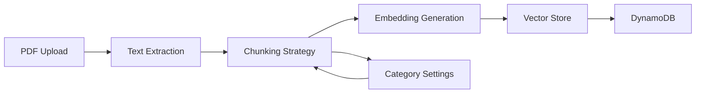
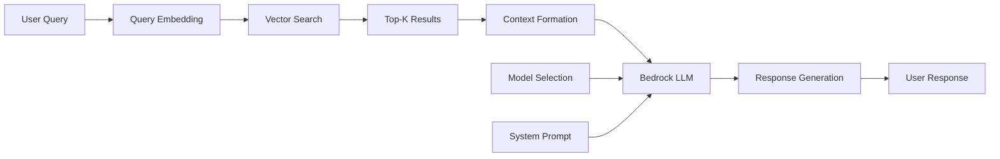

# AWS Bedrock Integration Design for BEACON Backend

## 🎯 Executive Summary

This document outlines the architectural design for integrating AWS Bedrock into the BEACON RAG system, replacing mock AI responses with real foundation models while implementing proper access control and model selection capabilities.

## 📋 Table of Contents
1. [Current State Analysis](#current-state-analysis)
2. [Target Architecture](#target-architecture)
3. [Bedrock Integration Components](#bedrock-integration-components)
4. [API Design Specifications](#api-design-specifications)
5. [Security & Access Control](#security--access-control)
6. [Data Flow Architecture](#data-flow-architecture)
7. [Implementation Roadmap](#implementation-roadmap)

---

## 🔍 Current State Analysis

### Existing Mock Implementation
```python
# Current: Static responses in app.py
MOCK_RESPONSES = [...]
CATEGORY_RESPONSES = {
    1: ["재무 문서를 분석한 결과입니다.", ...],
    2: ["맛집 정보를 확인했습니다.", ...],
    # ...
}
```

### Pain Points
- No real AI intelligence
- Static, non-contextual responses
- No actual document understanding
- Limited RAG capabilities
- No embedding generation

---

## 🏗️ Target Architecture

### High-Level Architecture
```
┌─────────────────────────────────────────────────────────┐
│                    Frontend (React)                      │
└────────────────────┬────────────────────────────────────┘
                     │ HTTPS
┌────────────────────▼────────────────────────────────────┐
│                   ALB (Application Load Balancer)        │
└────────────────────┬────────────────────────────────────┘
                     │
┌────────────────────▼────────────────────────────────────┐
│                  Flask Backend (EC2)                     │
│  ┌─────────────────────────────────────────────────┐   │
│  │            Bedrock Service Layer                 │   │
│  │  ┌──────────┐  ┌──────────┐  ┌──────────┐     │   │
│  │  │  Model   │  │   RAG    │  │  Vector  │     │   │
│  │  │ Manager  │  │  Engine  │  │  Store   │     │   │
│  │  └─────┬────┘  └─────┬────┘  └─────┬────┘     │   │
│  └────────┼─────────────┼─────────────┼───────────┘   │
└───────────┼─────────────┼─────────────┼────────────────┘
            │             │             │
┌───────────▼─────────────▼─────────────▼────────────────┐
│                    AWS Services                          │
│  ┌──────────┐  ┌──────────┐  ┌──────────┐            │
│  │ Bedrock  │  │    S3    │  │ DynamoDB │            │
│  │   API    │  │  Storage │  │  Vector  │            │
│  └──────────┘  └──────────┘  └──────────┘            │
└──────────────────────────────────────────────────────────┘
```

---

## 🔧 Bedrock Integration Components

### 1. Bedrock Service Manager (`bedrock_service.py`)
```python
import boto3
import json
from typing import List, Dict, Optional
from dataclasses import dataclass
from enum import Enum

class ModelProvider(Enum):
    ANTHROPIC = "anthropic"
    AI21 = "ai21"
    AMAZON = "amazon"
    COHERE = "cohere"
    META = "meta"
    MISTRAL = "mistral"

@dataclass
class BedrockModel:
    model_id: str
    provider: ModelProvider
    name: str
    description: str
    input_modalities: List[str]
    output_modalities: List[str]
    max_tokens: int
    supports_streaming: bool
    supports_system_prompt: bool
    cost_per_1k_input_tokens: float
    cost_per_1k_output_tokens: float

class BedrockService:
    def __init__(self, region_name='ap-northeast-2'):
        self.bedrock_client = boto3.client(
            service_name='bedrock',
            region_name=region_name
        )
        self.bedrock_runtime = boto3.client(
            service_name='bedrock-runtime',
            region_name=region_name
        )
        self.available_models = []
        self._refresh_available_models()
    
    def _refresh_available_models(self) -> None:
        """Fetch models with active access permissions"""
        try:
            response = self.bedrock_client.list_foundation_models()
            
            for model in response['modelSummaries']:
                # Check if model access is granted
                try:
                    access_response = self.bedrock_client.get_foundation_model_access(
                        modelId=model['modelId']
                    )
                    if access_response['status'] == 'ACTIVE':
                        self.available_models.append(self._parse_model_info(model))
                except:
                    continue  # Skip models without access
                    
        except Exception as e:
            print(f"Error fetching Bedrock models: {e}")
    
    def get_available_models(self, filter_by_capability=None) -> List[BedrockModel]:
        """Return list of accessible models"""
        if filter_by_capability:
            return [m for m in self.available_models 
                   if filter_by_capability in m.input_modalities]
        return self.available_models
    
    def invoke_model(self, model_id: str, prompt: str, 
                    system_prompt: Optional[str] = None,
                    max_tokens: int = 2048,
                    temperature: float = 0.7) -> Dict:
        """Invoke a Bedrock model with proper formatting"""
        
        model = self._get_model_by_id(model_id)
        if not model:
            raise ValueError(f"Model {model_id} not available")
        
        # Format request based on provider
        request_body = self._format_request(
            model, prompt, system_prompt, max_tokens, temperature
        )
        
        try:
            response = self.bedrock_runtime.invoke_model(
                modelId=model_id,
                contentType='application/json',
                accept='application/json',
                body=json.dumps(request_body)
            )
            
            response_body = json.loads(response['body'].read())
            return self._parse_response(model, response_body)
            
        except Exception as e:
            print(f"Error invoking Bedrock model: {e}")
            raise
    
    def _format_request(self, model: BedrockModel, prompt: str,
                       system_prompt: Optional[str], 
                       max_tokens: int, temperature: float) -> Dict:
        """Format request based on model provider requirements"""
        
        if model.provider == ModelProvider.ANTHROPIC:
            request = {
                "anthropic_version": "bedrock-2023-05-31",
                "messages": [{"role": "user", "content": prompt}],
                "max_tokens": max_tokens,
                "temperature": temperature
            }
            if system_prompt and model.supports_system_prompt:
                request["system"] = system_prompt
                
        elif model.provider == ModelProvider.AMAZON:
            request = {
                "inputText": prompt,
                "textGenerationConfig": {
                    "maxTokenCount": max_tokens,
                    "temperature": temperature
                }
            }
            
        elif model.provider == ModelProvider.META:
            request = {
                "prompt": prompt,
                "max_gen_len": max_tokens,
                "temperature": temperature
            }
            
        # Add other providers as needed
        else:
            request = {
                "prompt": prompt,
                "max_tokens": max_tokens,
                "temperature": temperature
            }
            
        return request
    
    def _parse_response(self, model: BedrockModel, response: Dict) -> Dict:
        """Parse response based on model provider format"""
        
        if model.provider == ModelProvider.ANTHROPIC:
            return {
                "text": response.get("content", [{}])[0].get("text", ""),
                "usage": response.get("usage", {}),
                "model": model.model_id
            }
        elif model.provider == ModelProvider.AMAZON:
            return {
                "text": response.get("results", [{}])[0].get("outputText", ""),
                "usage": {},
                "model": model.model_id
            }
        # Add other providers
        else:
            return {
                "text": response.get("completion", response.get("generation", "")),
                "usage": {},
                "model": model.model_id
            }
```

### 2. Enhanced RAG Engine (`rag_engine.py`)
```python
import numpy as np
from typing import List, Dict, Optional, Tuple
from dataclasses import dataclass
import boto3
import json
from sentence_transformers import SentenceTransformer

@dataclass
class Document:
    id: str
    content: str
    metadata: Dict
    embeddings: Optional[np.ndarray] = None
    
@dataclass
class QueryResult:
    document_id: str
    content: str
    score: float
    metadata: Dict

class RAGEngine:
    def __init__(self, bedrock_service: BedrockService, 
                 embedding_model: str = "amazon.titan-embed-text-v1"):
        self.bedrock_service = bedrock_service
        self.embedding_model = embedding_model
        self.vector_store = VectorStore()  # DynamoDB or OpenSearch
        self.chunk_size = 512
        self.chunk_overlap = 50
        
    def process_document(self, document: Document, category_settings: Dict) -> None:
        """Process document with category-specific settings"""
        
        # Apply category-specific chunking strategy
        chunks = self._chunk_document(
            document.content,
            strategy=category_settings.get('chunk_strategy', 'sentence'),
            size=category_settings.get('chunk_size', self.chunk_size),
            overlap=category_settings.get('chunk_overlap', self.chunk_overlap)
        )
        
        # Generate embeddings for each chunk
        embeddings = self._generate_embeddings(chunks)
        
        # Store in vector database
        for i, (chunk, embedding) in enumerate(zip(chunks, embeddings)):
            self.vector_store.add(
                document_id=f"{document.id}_chunk_{i}",
                content=chunk,
                embedding=embedding,
                metadata={
                    **document.metadata,
                    'chunk_index': i,
                    'total_chunks': len(chunks)
                }
            )
    
    def query(self, query: str, category_id: Optional[int] = None,
             top_k: int = 5) -> List[QueryResult]:
        """Query documents using semantic search"""
        
        # Generate query embedding
        query_embedding = self._generate_embeddings([query])[0]
        
        # Search vector store
        results = self.vector_store.search(
            query_embedding=query_embedding,
            top_k=top_k,
            filter={'category_id': category_id} if category_id else None
        )
        
        return results
    
    def generate_response(self, query: str, context: List[QueryResult],
                         model_id: str, system_prompt: Optional[str] = None) -> str:
        """Generate response using retrieved context"""
        
        # Format context for prompt
        context_text = self._format_context(context)
        
        # Create enhanced prompt
        prompt = f"""Based on the following context from uploaded documents, please answer the user's question.

Context:
{context_text}

User Question: {query}

Please provide a detailed and accurate answer based on the context provided. If the information is not available in the context, please say so."""
        
        # Use system prompt for category-specific behavior
        if not system_prompt:
            system_prompt = """You are BEACON AI, an intelligent document analysis assistant. 
            Provide accurate, helpful responses based on the uploaded documents. 
            Always cite which document your information comes from."""
        
        # Generate response using Bedrock
        response = self.bedrock_service.invoke_model(
            model_id=model_id,
            prompt=prompt,
            system_prompt=system_prompt,
            max_tokens=2048,
            temperature=0.7
        )
        
        return response['text']
    
    def _chunk_document(self, text: str, strategy: str, 
                       size: int, overlap: int) -> List[str]:
        """Chunk document based on strategy"""
        
        if strategy == 'sentence':
            # Sentence-based chunking
            import nltk
            nltk.download('punkt', quiet=True)
            sentences = nltk.sent_tokenize(text)
            chunks = []
            current_chunk = []
            current_size = 0
            
            for sentence in sentences:
                sentence_size = len(sentence.split())
                if current_size + sentence_size > size and current_chunk:
                    chunks.append(' '.join(current_chunk))
                    # Keep overlap
                    overlap_sentences = current_chunk[-overlap//10:] if overlap > 0 else []
                    current_chunk = overlap_sentences + [sentence]
                    current_size = sum(len(s.split()) for s in current_chunk)
                else:
                    current_chunk.append(sentence)
                    current_size += sentence_size
            
            if current_chunk:
                chunks.append(' '.join(current_chunk))
                
        elif strategy == 'paragraph':
            # Paragraph-based chunking
            paragraphs = text.split('\n\n')
            chunks = []
            for para in paragraphs:
                if len(para.split()) > size:
                    # Split large paragraphs
                    words = para.split()
                    for i in range(0, len(words), size - overlap):
                        chunks.append(' '.join(words[i:i+size]))
                else:
                    chunks.append(para)
                    
        else:  # 'fixed' or default
            # Fixed-size chunking
            words = text.split()
            chunks = []
            for i in range(0, len(words), size - overlap):
                chunks.append(' '.join(words[i:i+size]))
        
        return chunks
    
    def _generate_embeddings(self, texts: List[str]) -> List[np.ndarray]:
        """Generate embeddings using Bedrock Titan"""
        
        embeddings = []
        for text in texts:
            try:
                response = self.bedrock_service.bedrock_runtime.invoke_model(
                    modelId=self.embedding_model,
                    contentType='application/json',
                    accept='application/json',
                    body=json.dumps({"inputText": text})
                )
                
                result = json.loads(response['body'].read())
                embedding = np.array(result['embedding'])
                embeddings.append(embedding)
                
            except Exception as e:
                print(f"Error generating embedding: {e}")
                # Fallback to zero vector
                embeddings.append(np.zeros(1536))  # Titan embedding dimension
        
        return embeddings
    
    def _format_context(self, results: List[QueryResult]) -> str:
        """Format search results as context"""
        
        context_parts = []
        for i, result in enumerate(results, 1):
            context_parts.append(
                f"[Document {result.metadata.get('title', 'Unknown')} - "
                f"Relevance: {result.score:.2f}]\n{result.content}\n"
            )
        
        return "\n---\n".join(context_parts)
```

### 3. Vector Store Implementation (`vector_store.py`)
```python
import boto3
import numpy as np
from typing import List, Dict, Optional
import json
from decimal import Decimal

class VectorStore:
    """DynamoDB-based vector store with FAISS indexing"""
    
    def __init__(self, table_name: str = "beacon-vectors"):
        self.dynamodb = boto3.resource('dynamodb')
        self.table = self.dynamodb.Table(table_name)
        self.dimension = 1536  # Titan embedding dimension
        
        # In-memory FAISS index for similarity search
        import faiss
        self.index = faiss.IndexFlatL2(self.dimension)
        self.id_map = {}  # Map FAISS index to document IDs
        self._load_index()
    
    def add(self, document_id: str, content: str, 
           embedding: np.ndarray, metadata: Dict) -> None:
        """Add document to vector store"""
        
        # Store in DynamoDB
        self.table.put_item(
            Item={
                'document_id': document_id,
                'content': content,
                'embedding': embedding.tolist(),
                'metadata': json.loads(json.dumps(metadata), parse_float=Decimal)
            }
        )
        
        # Add to FAISS index
        self.index.add(embedding.reshape(1, -1))
        self.id_map[len(self.id_map)] = document_id
    
    def search(self, query_embedding: np.ndarray, 
              top_k: int = 5, filter: Optional[Dict] = None) -> List:
        """Search for similar documents"""
        
        # FAISS search
        distances, indices = self.index.search(
            query_embedding.reshape(1, -1), 
            min(top_k * 3, self.index.ntotal)  # Get more results for filtering
        )
        
        results = []
        for dist, idx in zip(distances[0], indices[0]):
            if idx == -1:
                continue
                
            doc_id = self.id_map[idx]
            
            # Retrieve from DynamoDB
            response = self.table.get_item(Key={'document_id': doc_id})
            if 'Item' not in response:
                continue
            
            item = response['Item']
            
            # Apply filters
            if filter:
                match = all(
                    item['metadata'].get(k) == v 
                    for k, v in filter.items()
                )
                if not match:
                    continue
            
            results.append(QueryResult(
                document_id=doc_id,
                content=item['content'],
                score=1 / (1 + float(dist)),  # Convert distance to similarity
                metadata=dict(item['metadata'])
            ))
            
            if len(results) >= top_k:
                break
        
        return results
    
    def delete(self, document_id_prefix: str) -> None:
        """Delete documents by ID prefix"""
        
        # Query items with prefix
        response = self.table.query(
            KeyConditionExpression='begins_with(document_id, :prefix)',
            ExpressionAttributeValues={':prefix': document_id_prefix}
        )
        
        # Delete from DynamoDB
        for item in response['Items']:
            self.table.delete_item(Key={'document_id': item['document_id']})
        
        # Rebuild FAISS index
        self._load_index()
    
    def _load_index(self) -> None:
        """Load all vectors into FAISS index"""
        
        import faiss
        self.index = faiss.IndexFlatL2(self.dimension)
        self.id_map = {}
        
        # Scan all items
        response = self.table.scan()
        
        for i, item in enumerate(response['Items']):
            embedding = np.array(item['embedding'], dtype=np.float32)
            self.index.add(embedding.reshape(1, -1))
            self.id_map[i] = item['document_id']
```

---

## 📡 API Design Specifications

### New Endpoints

#### 1. Get Available Models
```http
GET /api/bedrock/models
```

**Response:**
```json
{
  "models": [
    {
      "model_id": "anthropic.claude-3-sonnet-20240229-v1:0",
      "provider": "anthropic",
      "name": "Claude 3 Sonnet",
      "description": "Balanced performance and cost",
      "capabilities": ["text", "vision"],
      "max_tokens": 4096,
      "supports_streaming": true,
      "cost_per_1k_input": 0.003,
      "cost_per_1k_output": 0.015
    },
    {
      "model_id": "amazon.titan-text-express-v1",
      "provider": "amazon",
      "name": "Titan Text Express",
      "description": "Fast and cost-effective",
      "capabilities": ["text"],
      "max_tokens": 8192,
      "supports_streaming": false,
      "cost_per_1k_input": 0.0008,
      "cost_per_1k_output": 0.0016
    }
  ]
}
```

#### 2. Enhanced Chat with Model Selection
```http
POST /api/chat
```

**Request:**
```json
{
  "message": "재무 상태를 분석해주세요",
  "category_id": 1,
  "model_id": "anthropic.claude-3-sonnet-20240229-v1:0",
  "settings": {
    "temperature": 0.7,
    "max_tokens": 2048,
    "use_rag": true,
    "top_k_documents": 5
  }
}
```

**Response:**
```json
{
  "response": "업로드하신 재무제표를 분석한 결과...",
  "model_used": "anthropic.claude-3-sonnet-20240229-v1:0",
  "tokens_used": {
    "input": 1523,
    "output": 456
  },
  "cost_estimate": {
    "input_cost": 0.004569,
    "output_cost": 0.00684,
    "total_cost": 0.011409
  },
  "referenced_documents": [...],
  "confidence_score": 0.92
}
```

#### 3. Model Settings Management
```http
PUT /api/settings/bedrock
```

**Request:**
```json
{
  "default_model": "anthropic.claude-3-sonnet-20240229-v1:0",
  "fallback_model": "amazon.titan-text-express-v1",
  "max_retries": 3,
  "timeout_seconds": 30,
  "cost_limit_per_request": 0.50
}
```

### Modified Endpoints

#### Enhanced Upload with Embedding Generation
```http
POST /api/upload
```

**Processing Flow:**
1. Upload PDF
2. Extract text and images
3. Generate embeddings using Titan Embeddings
4. Store in vector database
5. Return with embedding status

**Response:**
```json
{
  "success": true,
  "document": {
    "id": 1,
    "title": "financial_report.pdf",
    "chunks_created": 45,
    "embeddings_generated": true,
    "processing_time": 3.2
  }
}
```

---

## 🔒 Security & Access Control

### IAM Role Configuration
```json
{
  "Version": "2012-10-17",
  "Statement": [
    {
      "Effect": "Allow",
      "Action": [
        "bedrock:InvokeModel",
        "bedrock:InvokeModelWithResponseStream"
      ],
      "Resource": [
        "arn:aws:bedrock:ap-northeast-2::foundation-model/anthropic.claude-*",
        "arn:aws:bedrock:ap-northeast-2::foundation-model/amazon.titan-*",
        "arn:aws:bedrock:ap-northeast-2::foundation-model/meta.llama3-*"
      ]
    },
    {
      "Effect": "Allow",
      "Action": [
        "bedrock:ListFoundationModels",
        "bedrock:GetFoundationModel",
        "bedrock:GetFoundationModelAccess"
      ],
      "Resource": "*"
    },
    {
      "Effect": "Allow",
      "Action": [
        "dynamodb:PutItem",
        "dynamodb:GetItem",
        "dynamodb:Query",
        "dynamodb:Scan",
        "dynamodb:DeleteItem"
      ],
      "Resource": "arn:aws:dynamodb:ap-northeast-2:*:table/beacon-vectors"
    },
    {
      "Effect": "Allow",
      "Action": [
        "s3:GetObject",
        "s3:PutObject",
        "s3:DeleteObject"
      ],
      "Resource": "arn:aws:s3:::beacon-documents/*"
    }
  ]
}
```

### Environment Variables
```bash
# Bedrock Configuration
BEDROCK_REGION=ap-northeast-2
BEDROCK_DEFAULT_MODEL=anthropic.claude-3-sonnet-20240229-v1:0
BEDROCK_EMBEDDING_MODEL=amazon.titan-embed-text-v1

# Vector Store Configuration
DYNAMODB_TABLE_NAME=beacon-vectors
VECTOR_DIMENSION=1536

# Cost Control
MAX_COST_PER_REQUEST=0.50
MAX_TOKENS_PER_REQUEST=4096
DAILY_COST_LIMIT=100.00

# Security
ENABLE_MODEL_ACCESS_CHECK=true
REQUIRE_API_KEY=false  # Set to true in production
```

---

## 🔄 Data Flow Architecture

### Document Processing Flow


### Query Processing Flow


---

## 🚀 Implementation Roadmap

### Phase 1: Foundation (Week 1-2)
- [ ] Set up AWS Bedrock access and permissions
- [ ] Implement BedrockService class
- [ ] Create model selection API
- [ ] Test with basic prompts

### Phase 2: Vector Store (Week 2-3)
- [ ] Set up DynamoDB table for vectors
- [ ] Implement vector store with FAISS
- [ ] Create embedding generation pipeline
- [ ] Test similarity search

### Phase 3: RAG Integration (Week 3-4)
- [ ] Implement RAG engine
- [ ] Integrate with existing upload flow
- [ ] Add context-aware response generation
- [ ] Test with real documents

### Phase 4: UI Enhancement (Week 4-5)
- [ ] Add model selection dropdown
- [ ] Display token usage and costs
- [ ] Show confidence scores
- [ ] Add response streaming

### Phase 5: Optimization (Week 5-6)
- [ ] Implement caching layer
- [ ] Add response streaming
- [ ] Optimize embedding generation
- [ ] Performance tuning

### Phase 6: Production Readiness (Week 6-7)
- [ ] Add comprehensive error handling
- [ ] Implement rate limiting
- [ ] Set up monitoring and alerting
- [ ] Load testing and optimization

---

## 📊 Cost Estimation

### Monthly Cost Breakdown (Estimated)
```
Bedrock API Calls:
- Claude 3 Sonnet: ~$50-100/month (10K requests)
- Titan Embeddings: ~$10-20/month (100K embeddings)

Infrastructure:
- DynamoDB: ~$25/month (25GB storage + queries)
- S3: ~$5/month (50GB documents)
- EC2 (existing): No additional cost

Total: ~$90-150/month
```

### Cost Optimization Strategies
1. **Model Tiering**: Use cheaper models for simple queries
2. **Caching**: Cache frequent queries and responses
3. **Batch Processing**: Batch embedding generation
4. **Smart Chunking**: Optimize chunk sizes to reduce tokens

---

## 🔧 Configuration Files

### `requirements.txt` Updates
```txt
# Existing dependencies...

# AWS Bedrock Integration
boto3>=1.34.0
botocore>=1.34.0

# Vector Store
faiss-cpu==1.7.4
numpy>=1.24.0

# Text Processing
nltk>=3.8
sentence-transformers>=2.2.0

# Monitoring
prometheus-client>=0.19.0
```

### Docker Environment Updates
```dockerfile
# Add to Dockerfile
ENV BEDROCK_REGION=ap-northeast-2
ENV BEDROCK_DEFAULT_MODEL=anthropic.claude-3-sonnet-20240229-v1:0
ENV PYTHONPATH=/app

# Install additional dependencies
RUN pip install --no-cache-dir boto3 faiss-cpu nltk
```

---

## 📈 Monitoring & Observability

### Key Metrics
```python
# Prometheus metrics
bedrock_requests_total = Counter('bedrock_requests_total', 'Total Bedrock API requests')
bedrock_tokens_used = Histogram('bedrock_tokens_used', 'Tokens used per request')
bedrock_response_time = Histogram('bedrock_response_time', 'Bedrock response time')
bedrock_cost_total = Counter('bedrock_cost_total', 'Total cost in USD')
vector_search_latency = Histogram('vector_search_latency', 'Vector search latency')
```

### CloudWatch Alarms
- High error rate (>5%)
- Excessive token usage (>10K per request)
- High cost per hour (>$10)
- Slow response time (>10s)

---

## 🧪 Testing Strategy

### Unit Tests
```python
def test_bedrock_model_listing():
    """Test that accessible models are correctly listed"""
    service = BedrockService()
    models = service.get_available_models()
    assert len(models) > 0
    assert all(m.model_id for m in models)

def test_rag_document_processing():
    """Test document chunking and embedding"""
    engine = RAGEngine(bedrock_service)
    document = Document(id="test", content="Test content...")
    engine.process_document(document, {})
    # Verify embeddings generated

def test_vector_similarity_search():
    """Test vector store search functionality"""
    store = VectorStore()
    # Add test vectors
    results = store.search(query_embedding, top_k=5)
    assert len(results) <= 5
```

### Integration Tests
- End-to-end document upload with embedding
- Query with RAG retrieval
- Model switching and fallback
- Cost tracking accuracy

---

## 📚 Appendix

### Supported Bedrock Models (as of 2024)
- **Anthropic**: Claude 3 (Opus, Sonnet, Haiku), Claude 2.1
- **Amazon**: Titan Text (Express, Lite), Titan Embeddings
- **Meta**: Llama 3 (8B, 70B)
- **AI21**: Jurassic-2 (Mid, Ultra)
- **Cohere**: Command, Embed
- **Mistral**: Mistral 7B, Mixtral 8x7B

### References
- [AWS Bedrock Documentation](https://docs.aws.amazon.com/bedrock/)
- [Bedrock Pricing](https://aws.amazon.com/bedrock/pricing/)
- [FAISS Documentation](https://github.com/facebookresearch/faiss)
- [LangChain Bedrock Integration](https://python.langchain.com/docs/integrations/llms/bedrock)

---

**Document Version**: 1.0  
**Last Updated**: 2024  
**Author**: BEACON Development Team  
**Status**: Design Phase